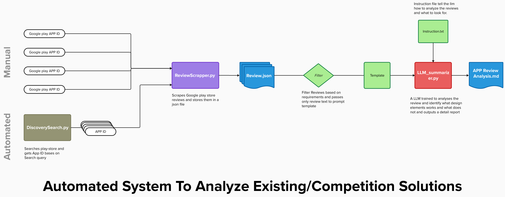

# 🔍 Automated System to Analyze Existing/Competition Solutions

This project provides a fully or semi-automated pipeline to analyze user reviews from the Google Play Store in order to understand what design elements work well — and which do not — in existing or competing applications. The system leverages Python scripts, Google Play scraping, review filtering, templating, and a Large Language Model (LLM) to generate comprehensive and actionable design analysis reports.

---

## 🧭 System Architecture



> The system supports both manual and automated flows for collecting and analyzing app reviews from the Google Play Store.

---

## 📌 Key Features

- ✅ **Automated and Manual Input Support**  
  Accepts app IDs manually or fetches them automatically via search.

- 📥 **Review Collection**  
  Scrapes and stores Google Play Store app reviews in JSON format.

- 🧹 **Review Filtering**  
  Filters reviews based on customizable requirements (e.g., sentiment, relevance).

- 🧠 **LLM-Based Analysis**  
  An LLM processes filtered reviews with a prompt template and instruction set to generate a detailed markdown report.

- 📄 **Actionable Insights**  
  Outputs a `.md` report highlighting successful and problematic design elements for informed decision-making.

---

## 🚀 How It Works

### 1. **App ID Collection**
- **Manual**: Provide App IDs manually.
- **Automated**: Use `DiscoverySearch.py` to fetch relevant App IDs based on a search query.

### 2. **Scrape Reviews**
- `ReviewScrapper.py` downloads reviews for each App ID and stores them in `review.json`.

### 3. **Filter Reviews**
- The reviews are filtered to remove noise or irrelevant content.
- Only the cleaned review text is passed to the prompt generator.

### 4. **Generate Prompt Template**
- Review texts are structured using a predefined template.
- `Instruction.txt` provides specific guidelines to the LLM for review analysis.

### 5. **LLM Analysis**
- `LLM_summarizer.py` uses an LLM to evaluate what users liked or disliked.
- It identifies patterns in user feedback around app features, UI, performance, etc.

### 6. **Generate Final Report**
- The result is a markdown file (`APP_Review_Analysis.md`) summarizing actionable insights and design feedback.

---

## 🧱 Project Structure

```bash
.
├── DiscoverySearch.py         # Automated script to find App IDs via search
├── ReviewScrapper.py          # Scrapes reviews for a given App ID
├── review.json                # Stores raw scraped reviews
├── Filter                     # Filters reviews based on criteria
├── Template                   # Prompt template for the LLM
├── Instruction.txt            # Custom instructions guiding LLM analysis
├── LLM_summarizer.py          # Runs LLM analysis and generates a report
└── APP_Review_Analysis.md     # Final output: insights in Markdown format
